## Тестирование UI веб-сайта Школы 21

**Всего найдено - 37 багов**

### Отсутствие изображения 

**Заголовок:** Отсутствие изображения в шапке сайта

**Подробное описание:** На странице школы (ссылка) нет заявленной картинки в хедере

**Ожидаемый результат:** При переходе на сайт школы в шапке сайта присутствует изображение, как показано на макете

**Фактический результат:** При переходе на сайт школы Изображение в шапке сайта отсутствует

**Шаги по воспроизведению:** 

1. Открыть макет сайта https://www.figma.com/design/eTKqLIoG72PDLMuLUM4g7n/%D0%A1%D0%B1%D0%B5%D1%8021?node-id=0-1&p=f&t=WVif7Dth1VyTmZPS-0

2. Открыть сайт (ссылка) 

3. Убедиться, что шапка страницы пустая — изображение отсутствует

**Окружение:** Linux 6.8.0-48-generic, Google Chrome 127.0.6533.99 

**Важность:** Minor

**Срочность:** Medium

**Дополнительная информация:** скриншот, демонстрирующий проблему, приложен

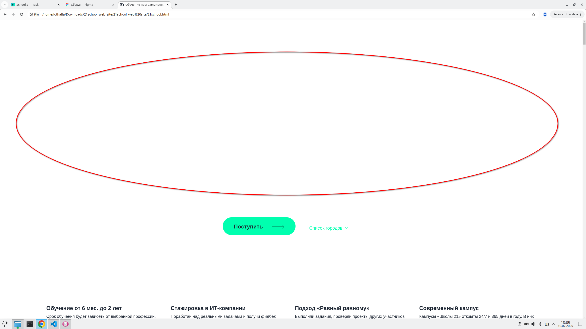

**Заголовок:** Отсутствие изображения в разделе "Методология" 

**Подробное описание:** На странице школы (ссылка) нет заявленного изображения в разделе "Методология", справа от заголовка "Прокачиваем не только профессиональные, но и мягкие навыки, которые ценятся на рынке в ИТ"

**Ожидаемый результат:** При переходе на сайт школы в разделе "Методология", справа от заголовка "Прокачиваем не только профессиональные, но и мягкие навыки, которые ценятся на рынке в ИТ" есть изображение о_школе

**Дополнительная информация:** скриншот, демонстрирующий проблему, приложен

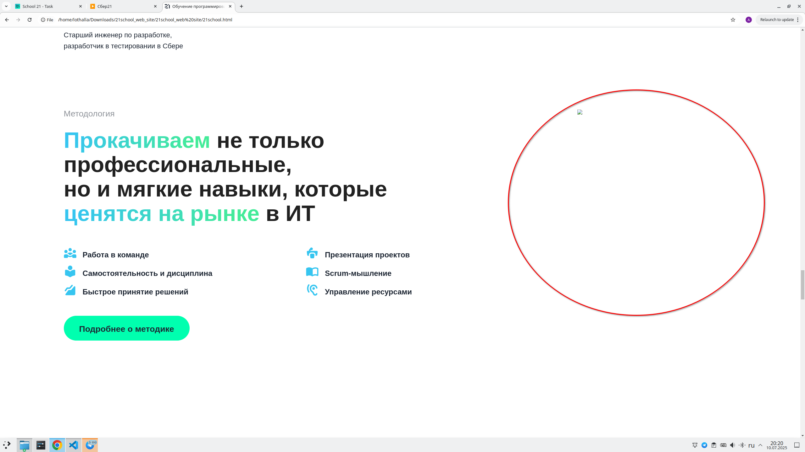

**Заголовок:** Отсутствие изображения в разделе "В «Школу 21» может поступить любой желающий" 

**Подробное описание:** На странице школы (ссылка) нет заявленного изображения в разделе "В «Школу 21» может поступить любой желающий", справа от данного заголовка

**Ожидаемый результат:** При переходе на сайт школы в разделе "В «Школу 21» может поступить любой желающий" есть изображение 

**Фактический результат:** При переходе на сайт школы в разделе "В «Школу 21» может поступить любой желающий" отсутствует изображение

**Шаги по воспроизведению:**   

1. Открыть макет сайта https://www.figma.com/design/eTKqLIoG72PDLMuLUM4g7n/%D0%A1%D0%B1%D0%B5%D1%8021?node-id=0-1&p=f&t=WVif7Dth1VyTmZPS-0

2. Открыть сайт (ссылка) 

3. Опуститься в раздел "В «Школу 21» может поступить любой желающий"

4. Сравнить данный раздел на макете с сайтом

5. Убедиться, что изображение отсутсвует

**Окружение:** Linux 6.8.0-48-generic, Google Chrome 127.0.6533.99 

**Важность:** Minor

**Срочность:** Low

**Дополнительная информация:** скриншот, демонстрирующий проблему, приложен

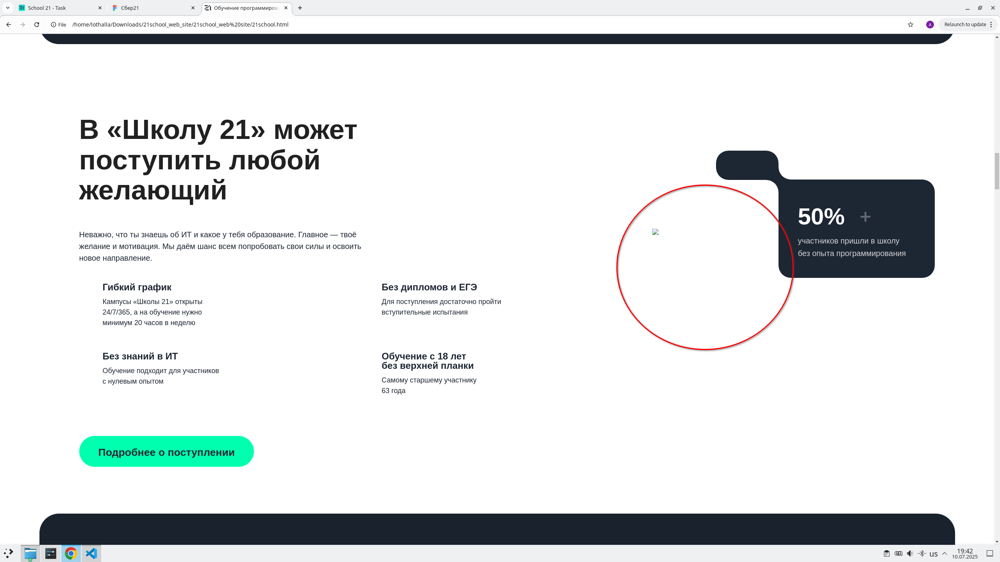

**Заголовок:** Отсутствие изображения в разделе "Начало обучения" 

**Подробное описание:** На странице школы (ссылка) нет заявленного изображения в разделе "Начало обучения", под заголовком "Через несколько недель после «бассейна» начнётся учёба"

**Ожидаемый результат:** При переходе на сайт школы в разделе "Начало обучения" есть изображение под заголовком "Через несколько недель после «бассейна» начнётся учёба"

**Фактический результат:** При переходе на сайт школы в разделе "Начало обучения" под заголовком "Через несколько недель после «бассейна» начнётся учёба" изображение отсутствует

**Шаги по воспроизведению:** 

1. Открыть макет сайта https://www.figma.com/design/eTKqLIoG72PDLMuLUM4g7n/%D0%A1%D0%B1%D0%B5%D1%8021?node-id=0-1&p=f&t=WVif7Dth1VyTmZPS-0

2. Открыть сайт (ссылка) 

3. Опуститься в раздел "Начало обучения"

4. Сравнить данный раздел на макете с сайтом

5. Убедиться, что изображение отсутствует

**Окружение:** Linux 6.8.0-48-generic, Google Chrome 127.0.6533.99 

**Важность:** Minor

**Срочность:** Low

**Дополнительная информация:** скриншот, демонстрирующий проблему, приложен

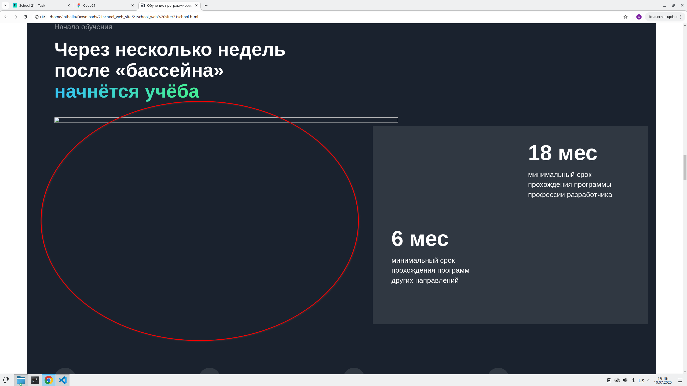

**Заголовок:** Нет привьюшных изображений у видео в разделе "Участники и выпускники о «Школе 21»"

**Подробное описание:** На странице школы (ссылка) нет привью изображений у видео материалов в разделе "Участники и выпускники о «Школе 21»"

**Ожидаемый результат:** При переходе на сайт школы в разделе "Участники и выпускники о «Школе 21»" есть привью изображения у видео материалов

**Фактический результат:** При переходе на сайт школы в разделе "Участники и выпускники о «Школе 21»" привью изображения у видео материалов отсутствуют

**Шаги по воспроизведению:** 

1. Открыть макет сайта https://www.figma.com/design/eTKqLIoG72PDLMuLUM4g7n/%D0%A1%D0%B1%D0%B5%D1%8021?node-id=0-1&p=f&t=WVif7Dth1VyTmZPS-0

2. Открыть сайт (ссылка) 

3. Опуститься в раздел "Участники и выпускники о «Школе 21»"

4. Сравнить данный раздел на макете с сайтом

5. Убедиться, что изображения у видео материалов отсутствуют

**Окружение:** Linux 6.8.0-48-generic, Google Chrome 127.0.6533.99 

**Важность:** Minor

**Срочность:** Medium

**Дополнительная информация:** скриншот, демонстрирующий проблему, приложен

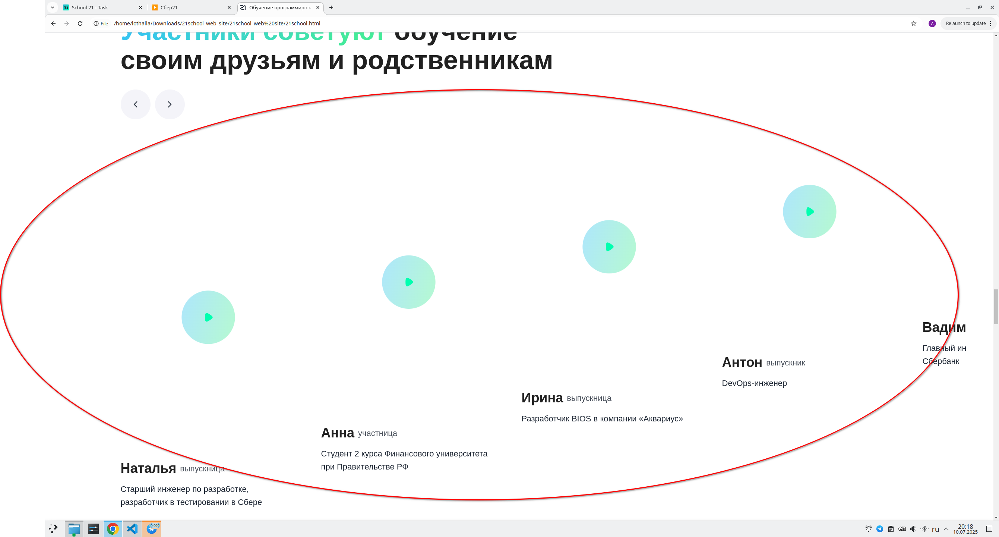

### Фреймы

**Заголовок:** В разделе "Программа обучения" у блоков "C/C++", "Алгоритмы" и "Языки программирования" острые края

**Подробное описание:** На странице школы (ссылка) в разделе "Программа обучения" у блоков "C/C++", "Алгоритмы" и "Языки программирования" не обтекаемая форма у левого верхнего угла
 
**Ожидаемый результат:** При переходе на сайт школы в разделе "Программа обучения" у блоков "C/C++", "Алгоритмы" и "Языки программирования" обтекаемая (мягкая) форма у левого верхнего угла

**Фактический результат:** При переходе на сайт школы в разделе "Программа обучения" у блоков "C/C++", "Алгоритмы" и "Языки программирования" не обтекаемая (острая) форма у левого верхнего угла

**Шаги по воспроизведению:** 

1. Открыть макет сайта https://www.figma.com/design/eTKqLIoG72PDLMuLUM4g7n/%D0%A1%D0%B1%D0%B5%D1%8021?node-id=0-1&p=f&t=WVif7Dth1VyTmZPS-0

2. Открыть сайт (ссылка) 

3. Опуститься в раздел "Программа обучения"

4. Сравнить данный раздел на макете с сайтом

5. Убедиться, что форма у левого верхнего угла острая

**Окружение:** Linux 6.8.0-48-generic, Google Chrome 127.0.6533.99 

**Важность:** Minor

**Срочность:** Low

**Дополнительная информация:** скриншот, демонстрирующий проблему, приложен

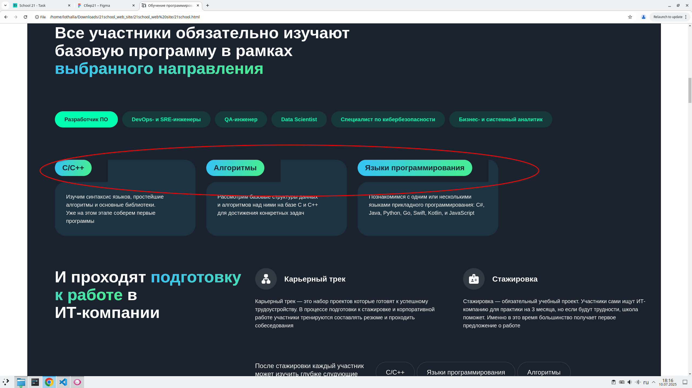

**Заголовок:** В разделе "Начало обучения" вместо двух раздельных блоков - один большой

**Подробное описание:** На странице школы (ссылка) в разделе "Начало обучения" один блок "18 месяцев" и "6 месяцев", вместо двух раздельных

**Ожидаемый результат:** При переходе на сайт школы в разделе "Начало обучения" должно быть 2 раздельных, с обтекаемой, прямоугольной формой блока - "18 месяцев" и "6 месяцев"

**Фактический результат:** При переходе на сайт школы в разделе "Начало обучения" 1 большой блок содержащий в себе текст "18 месяцев" и "6 месяцев"

**Шаги по воспроизведению:** 

1. Открыть макет сайта https://www.figma.com/design/eTKqLIoG72PDLMuLUM4g7n/%D0%A1%D0%B1%D0%B5%D1%8021?node-id=0-1&p=f&t=WVif7Dth1VyTmZPS-0

2. Открыть сайт (ссылка) 

3. Опуститься в раздел "Начало обучения"

4. Сравнить данный раздел на макете с сайтом

5. Убедиться, что вместо двух раздельных, с обтекаемой, прямоугольной формой блока - "18 месяцев" и "6 месяцев", есть 1 большой квадратный блок

**Окружение:** Linux 6.8.0-48-generic, Google Chrome 127.0.6533.99 

**Важность:** Minor

**Срочность:** Low

**Дополнительная информация:** скриншот, демонстрирующий проблему, приложен

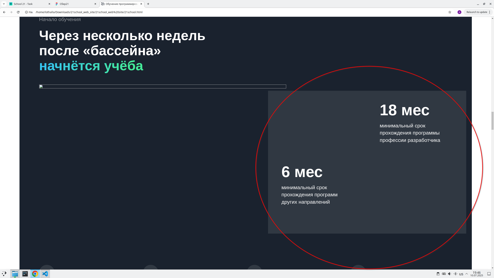

**Заголовок:** У блока "Заявка на поступление" нет обтекаемой выемки в правом верхнем углу

**Подробное описание:** На странице школы (ссылка) у блока "Заявка на поступление" нет обтекаемой выемки в правом верхнем углу

**Ожидаемый результат:** При переходе на сайт школы у блока "Заявка на поступление" должна быть обтекаемая выемка в правом верхнем углу

**Фактический результат:** При переходе на сайт школы у блока "Заявка на поступление" обтекаемая выемка в правом верхнем углу отсутствует

**Шаги по воспроизведению:** 

1. Открыть макет сайта https://www.figma.com/design/eTKqLIoG72PDLMuLUM4g7n/%D0%A1%D0%B1%D0%B5%D1%8021?node-id=0-1&p=f&t=WVif7Dth1VyTmZPS-0

2. Открыть сайт (ссылка) 

3. Опуститься в раздел "Заявка на поступление"

4. Сравнить данный раздел на макете с сайтом

5. Убедиться, что нет обтекаемой выемки в правом верхнем углу блока

**Окружение:** Linux 6.8.0-48-generic, Google Chrome 127.0.6533.99 

**Важность:** Minor

**Срочность:** Low

**Дополнительная информация:** скриншот, демонстрирующий проблему, приложен

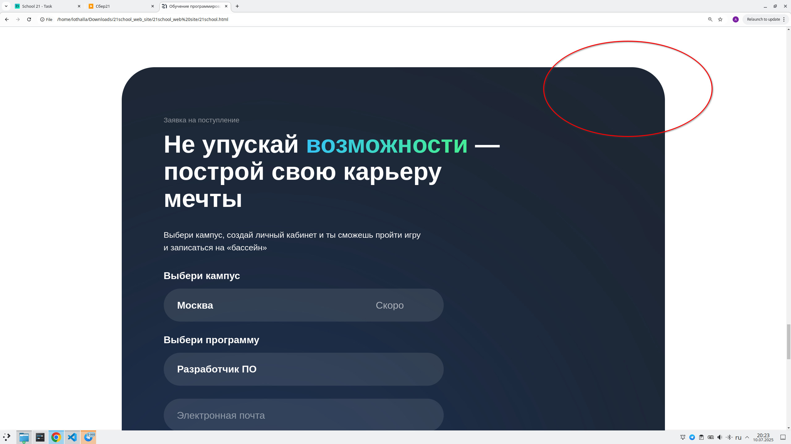

**Заголовок:** У блока "Программа обучения" нет обтекаемых выемок 

**Подробное описание:** На странице школы (ссылка) у блока "Программа обучения" нет обтекаемых выемок в правом верхнем и в левом нижнем углах

**Ожидаемый результат:** При переходе на сайт школы у блока "Программа обучения" есть обтекаемые выемки в правом верхнем и в левом нижнем углах

**Фактический результат:** При переходе на сайт школы у блока "Программа обучения" выемки в правом верхнем и в левом нижнем углах отсутствуют

**Шаги по воспроизведению:** 

1. Открыть макет сайта https://www.figma.com/design/eTKqLIoG72PDLMuLUM4g7n/%D0%A1%D0%B1%D0%B5%D1%8021?node-id=0-1&p=f&t=WVif7Dth1VyTmZPS-0

2. Открыть сайт (ссылка) 

3. Опуститься в раздел "Программа обучения"

4. Сравнить данный раздел на макете с сайтом

5. Убедиться, что нет обтекаемых выемок в правом верхнем и в левом нижнем углах

**Окружение:** Linux 6.8.0-48-generic, Google Chrome 127.0.6533.99 

**Важность:** Minor

**Срочность:** Low

**Дополнительная информация:** скриншот, демонстрирующий проблему, приложен

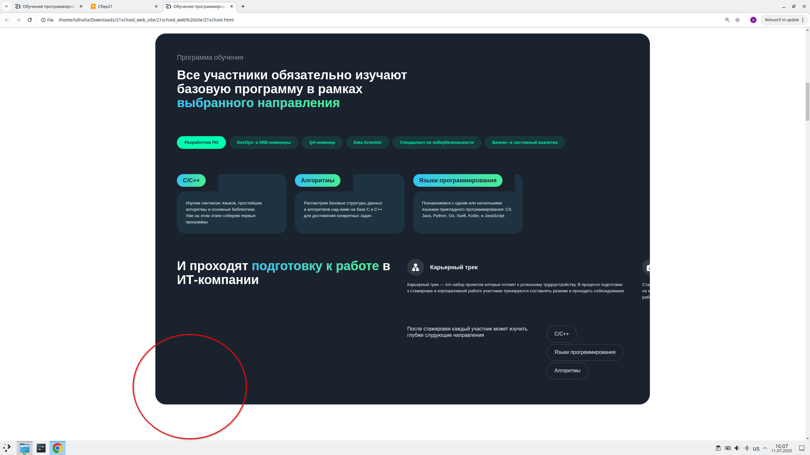

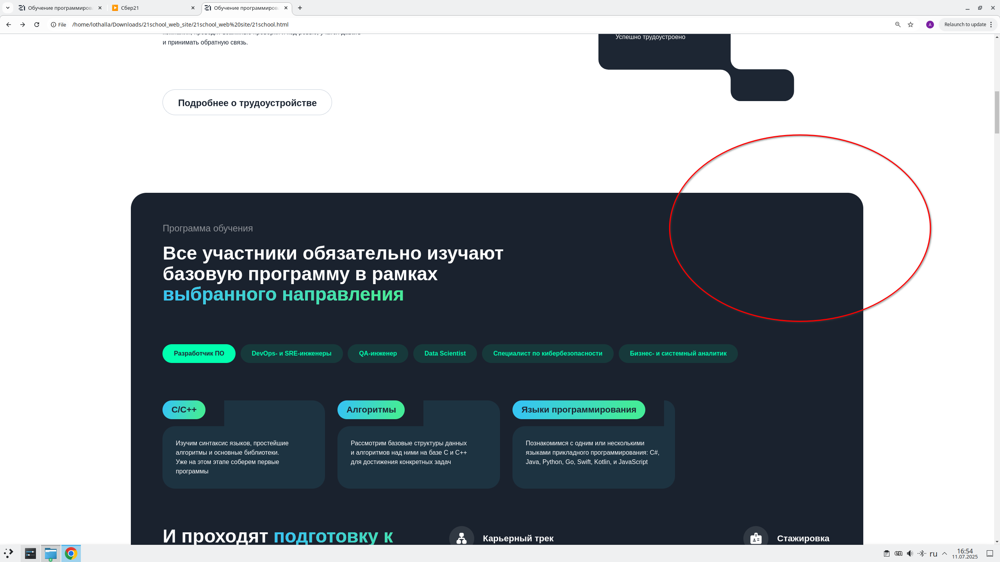

**Заголовок:** У блока "Этапы поступления" нет обтекаемой выемки в правом верхнем углу

**Подробное описание:** На странице школы (ссылка) у блока "Этапы поступления" нет обтекаемой выемки в правом верхнем углу

**Ожидаемый результат:** При переходе на сайт школы у блока "Этапы поступления" должна быть обтекаемая выемка в правом верхнем углу

**Фактический результат:** При переходе на сайт школы у блока "Этапы поступления" обтекаемая выемка в правом верхнем углу отсутствует

**Шаги по воспроизведению:** 

1. Открыть макет сайта https://www.figma.com/design/eTKqLIoG72PDLMuLUM4g7n/%D0%A1%D0%B1%D0%B5%D1%8021?node-id=0-1&p=f&t=WVif7Dth1VyTmZPS-0

2. Открыть сайт (ссылка) 

3. Опуститься в раздел "Этапы поступления"

4. Сравнить данный раздел на макете с сайтом

5. Убедиться, что нет обтекаемой выемки в правом верхнем углу блока

**Окружение:** Linux 6.8.0-48-generic, Google Chrome 127.0.6533.99 

**Важность:** Minor

**Срочность:** Low

**Дополнительная информация:** скриншот, демонстрирующий проблему, приложен

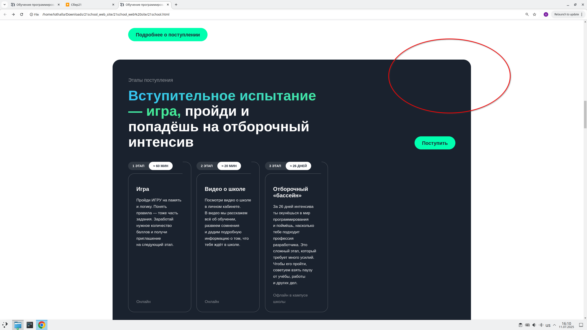

**Заголовок:** У самого нижнего блока "О Школе", "Поступающим", "Партнерам" нет обтекаемой выемки в правом верхнем углу

**Подробное описание:** На странице школы (ссылка) у самого нижнего блока "О Школе", "Поступающим", "Партнерам" нет обтекаемой выемки в правом верхнем углу

**Ожидаемый результат:** При переходе на сайт школы у самого нижнего блока "О Школе", "Поступающим", "Партнерам" должна быть обтекаемая выемка в правом верхнем углу

**Фактический результат:** При переходе на сайт школы у самого нижнего блока "О Школе", "Поступающим", "Партнерам" обтекаемая выемка в правом верхнем углу отсутствует

**Шаги по воспроизведению:** 

1. Открыть макет сайта https://www.figma.com/design/eTKqLIoG72PDLMuLUM4g7n/%D0%A1%D0%B1%D0%B5%D1%8021?node-id=0-1&p=f&t=WVif7Dth1VyTmZPS-0

2. Открыть сайт (ссылка) 

3. Опуститься в раздел "О Школе", "Поступающим", "Партнерам"

4. Сравнить данный раздел на макете с сайтом

5. Убедиться, что нет обтекаемой выемки в правом верхнем углу блока

**Окружение:** Linux 6.8.0-48-generic, Google Chrome 127.0.6533.99 

**Важность:** Minor

**Срочность:** Low

**Дополнительная информация:** скриншот, демонстрирующий проблему, приложен

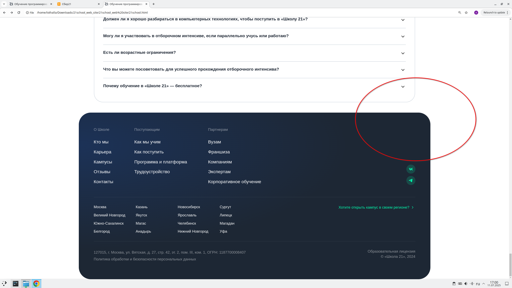

### Отутствие блока

**Заголовок:** Отсутствует блок "Кампусы"

**Подробное описание:** На странице школы (ссылка) отсутствует блок "Кампусы", который находится между блоками "Методология" и "Заявка на поступление"

**Ожидаемый результат:** При переходе на сайт школы блок "Кампусы" присутствует и находится между блоками "Методология" и "Заявка на поступление"

**Фактический результат:** При переходе на сайт школы блок "Кампусы" отсутствует

**Шаги по воспроизведению:**

1. Открыть сайт (ссылка)

2. Открыть макет сайта https://www.figma.com/design/eTKqLIoG72PDLMuLUM4g7n/%D0%A1%D0%B1%D0%B5%D1%8021?node-id=0-1&p=f&t=WVif7Dth1VyTmZPS-0

3. Опуститься в раздел "Кампусы"

4. Сравнить данный раздел на макете с сайтом

5. Убедиться, что на сайте отсутствует блок "Кампусы"

**Окружение:** Linux 6.8.0-48-generic, Google Chrome 127.0.6533.99 

**Важность:** Major

**Срочность:** Medium

**Дополнительная информация:** скриншот, демонстрирующий проблему, приложен

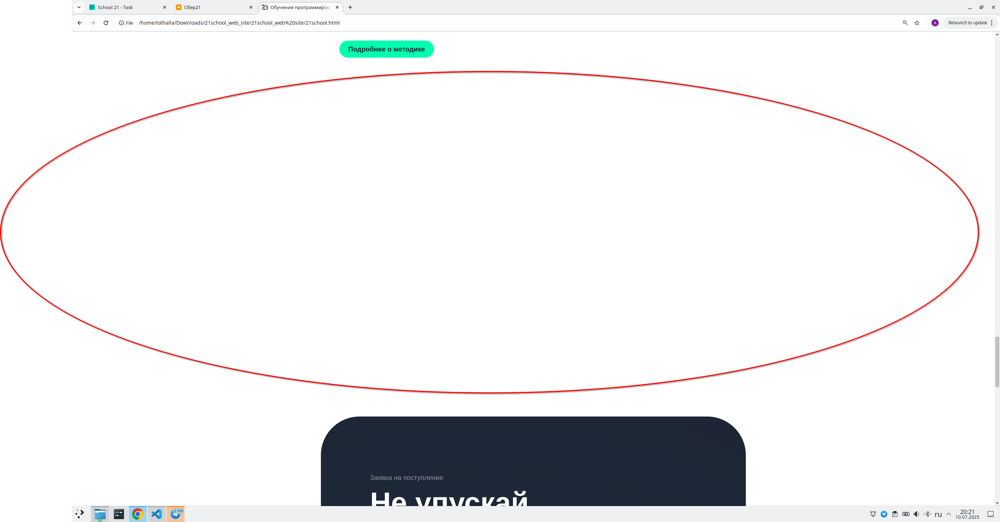

### Ошибки в тексте / отступы

**Заголовок:** Отступ в разделе "Программа обучения" в блоке "Языки программирования"

**Подробное описание:** На странице школы (ссылка) в разделе "Программа обучения" в блоке "Языки программирования" некорректный отступ

**Ожидаемый результат:** При переходе на сайт школы в разделе "Программа обучения" в блоке "Языки программирования" корректный отступ, как показано на макете

**Фактический результат:** При переходе на сайт школы в разделе "Программа обучения" в блоке "Языки программирования" некорректный отступ, который портит визуальный вид расположения текста 

**Шаги по воспроизведению:**

1. Открыть макет сайта https://www.figma.com/design/eTKqLIoG72PDLMuLUM4g7n/%D0%A1%D0%B1%D0%B5%D1%8021?node-id=0-1&p=f&t=WVif7Dth1VyTmZPS-0

2. Открыть сайт (ссылка) 

3. Опуститься в раздел "Программа обучения"

4. Сравнить блок "Языки программирования" на макете с сайтом

5. Убедиться, что на сайте в блоке "Языки программирования" некорректный отступ

**Окружение:** Linux 6.8.0-48-generic, Google Chrome 127.0.6533.99 

**Важность:** Trivial

**Срочность:** Low

**Дополнительная информация:** скриншот, демонстрирующий проблему, приложен

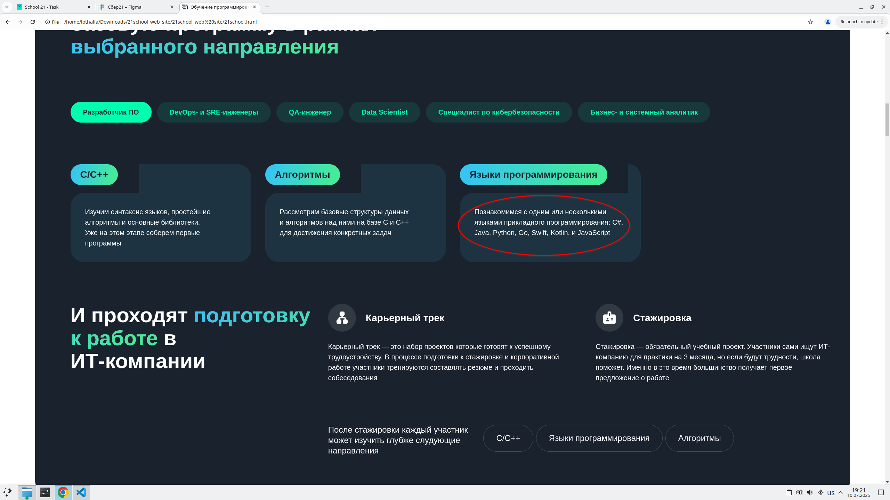

**Заголовок:** Орфографическая ошибка в слове "следующие" в разделе "Программа обучения"

**Подробное описание:** На странице школы (ссылка) в разделе "Программа обучения" в нижнем абзаце в слове "следующие" ошибка

**Ожидаемый результат:** При переходе на сайт школы в разделе "Программа обучения" в нижнем абзаце нет орфографическая ошибок

**Фактический результат:** При переходе на сайт школы в разделе "Программа обучения" в нижнем абзаце слово "следующие" написано как "слудующие"

**Шаги по воспроизведению:**

1. Открыть макет сайта https://www.figma.com/design/eTKqLIoG72PDLMuLUM4g7n/%D0%A1%D0%B1%D0%B5%D1%8021?node-id=0-1&p=f&t=WVif7Dth1VyTmZPS-0

2. Открыть сайт (ссылка) 

3. Опуститься в раздел "Программа обучения"

4. Убедиться, что на сайте и на макете в разделе "Программа обучения" в нижнем абзаце в слове "следующие" ошибка

**Окружение:** Linux 6.8.0-48-generic, Google Chrome 127.0.6533.99 

**Важность:** Trivial

**Срочность:** Low

**Дополнительная информация:** скриншот, демонстрирующий проблему, приложен

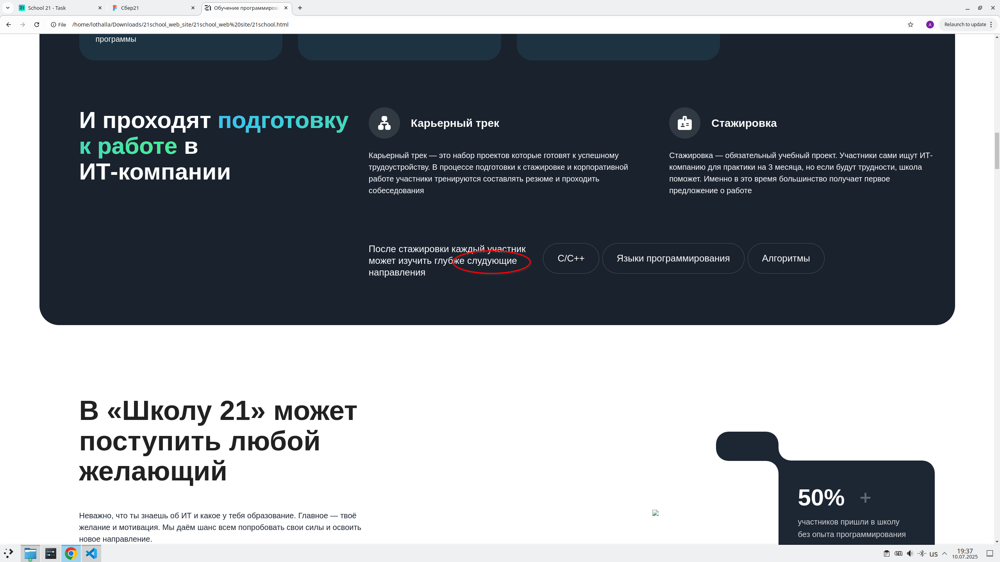

**Заголовок:** Отступ в разделе "Начало обучения" в блоке "Задачи из реальной практики"

**Подробное описание:** На странице школы (ссылка) в разделе "Начало обучения" в блоке "Задачи из реальной практики" некорректный отступ

**Ожидаемый результат:** При переходе на сайт школы в разделе "Начало обучения" в блоке "Задачи из реальной практики" корректный отступ, как показано на макете

**Фактический результат:** При переходе на сайт школы в разделе "Начало обучения" в блоке "Задачи из реальной практики" некорректный отступ, который портит визуальный вид расположения текста 

**Шаги по воспроизведению:**

1. Открыть макет сайта https://www.figma.com/design/eTKqLIoG72PDLMuLUM4g7n/%D0%A1%D0%B1%D0%B5%D1%8021?node-id=0-1&p=f&t=WVif7Dth1VyTmZPS-0

2. Открыть сайт (ссылка) 

3. Опуститься в раздел "Начало обучения"

4. Сравнить блок "Задачи из реальной практики" на макете с сайтом

5. Убедиться, что на сайте в блоке "Задачи из реальной практики" некорректный отступ

**Окружение:** Linux 6.8.0-48-generic, Google Chrome 127.0.6533.99 

**Важность:** Trivial

**Срочность:** Low

**Дополнительная информация:** скриншот, демонстрирующий проблему, приложен

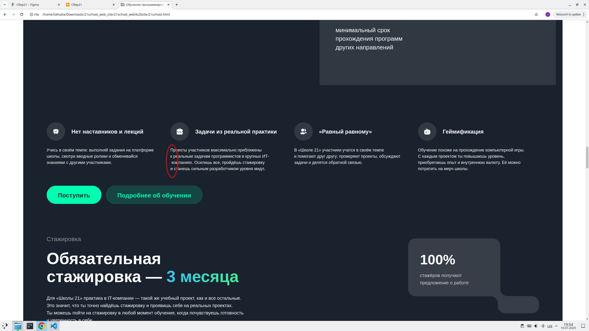

### Отсутствие иконок

**Заголовок:** Отсутствуют иконки в шапке страницы

**Подробное описание:** На странице школы (ссылка) в хедере страницы отсутствуют иконки "Обучение от 6 мес. до 2 лет", "Стажировка в ИТ-компании", "Подход равный равному", "Современный кампус"

**Ожидаемый результат:** При переходе на сайт школы в шапке страницы, под изображением есть 4 иконки: "Обучение от 6 мес. до 2 лет", "Стажировка в ИТ-компании", "Подход равный равному", "Современный кампус"

**Фактический результат:** При переходе на сайт школы в шапке страницы, под изображением отсутствуют иконки "Обучение от 6 мес. до 2 лет", "Стажировка в ИТ-компании", "Подход равный равному", "Современный кампус"

**Шаги по воспроизведению:**

1. Открыть макет сайта https://www.figma.com/design/eTKqLIoG72PDLMuLUM4g7n/%D0%A1%D0%B1%D0%B5%D1%8021?node-id=0-1&p=f&t=WVif7Dth1VyTmZPS-0

2. Открыть сайт (ссылка) 

3. Убедиться, что в шапке страницы отсутствуют иконки "Обучение от 6 мес. до 2 лет", "Стажировка в ИТ-компании", "Подход равный равному", "Современный кампус"

**Окружение:** Linux 6.8.0-48-generic, Google Chrome 127.0.6533.99 

**Важность:** Trivial

**Срочность:** Low

**Дополнительная информация:** скриншот, демонстрирующий проблему, приложен

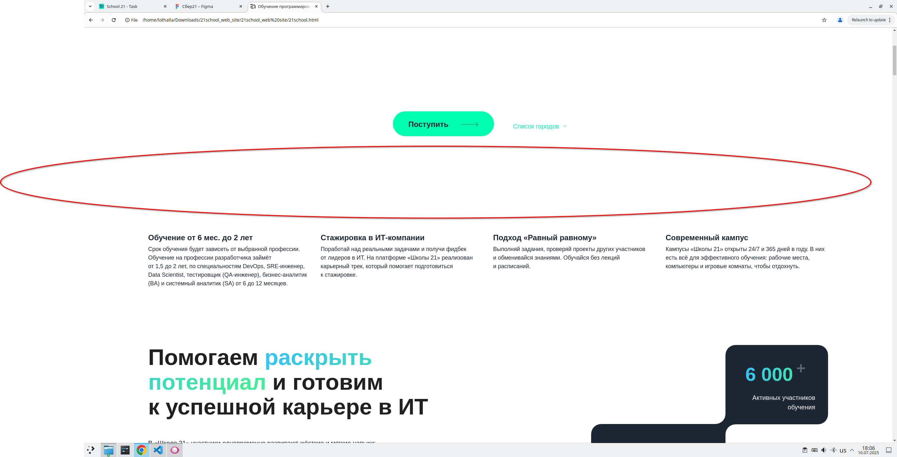

**Заголовок:** Отсутствуют иконки в разделе "В «Школу 21» может поступить любой желающий"

**Подробное описание:** На странице школы (ссылка) в разделе "В «Школу 21» может поступить любой желающий" отсутствуют иконки у 4 блоков: "Гибкий график", "Без знаний в ИТ", "Без дипломов и ЕГЭ", "Обучение с 18 лет без верхней планки"

**Ожидаемый результат:** При переходе на сайт школы в разделе "В «Школу 21» может поступить любой желающий" есть иконки у 4 блоков: "Гибкий график", "Без знаний в ИТ", "Без дипломов и ЕГЭ", "Обучение с 18 лет без верхней планки"

**Фактический результат:** При переходе на сайт школы в разделе "В «Школу 21» может поступить любой желающий" иконки у 4 блоков: "Гибкий график", "Без знаний в ИТ", "Без дипломов и ЕГЭ", "Обучение с 18 лет без верхней планки" отсутствуют

**Шаги по воспроизведению:**

1. Открыть макет сайта https://www.figma.com/design/eTKqLIoG72PDLMuLUM4g7n/%D0%A1%D0%B1%D0%B5%D1%8021?node-id=0-1&p=f&t=WVif7Dth1VyTmZPS-0

2. Открыть сайт (ссылка) 

3. Убедиться, что в разделе "В «Школу 21» может поступить любой желающий" отсутствуют иконки у 4 блоков: "Гибкий график", "Без знаний в ИТ", "Без дипломов и ЕГЭ", "Обучение с 18 лет без верхней планки"

**Окружение:** Linux 6.8.0-48-generic, Google Chrome 127.0.6533.99 

**Важность:** Trivial

**Срочность:** Low

**Дополнительная информация:** скриншот, демонстрирующий проблему, приложен

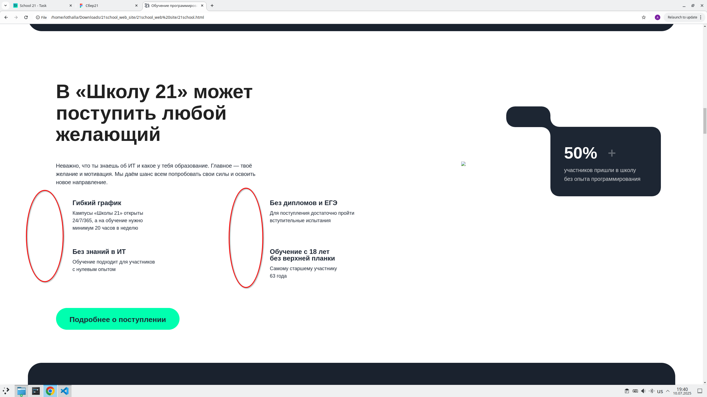

### Лишние элементы

**Заголовок:** Лишний элемент(кнопка) в разделе "Методология"

**Подробное описание:** На странице школы (ссылка) в разделе "Методология" под заголовком "Прокачиваем не только профессиональные, но и мягкие навыки, которые ценятся на рынке в ИТ" лишний элемент (кнопка - "Подробнее о методике"), которой нет на макете

**Ожидаемый результат:** При переходе на сайт школы в разделе "Методология" под заголовком "Прокачиваем не только профессиональные, но и мягкие навыки, которые ценятся на рынке в ИТ" есть только перечень мягких навыков, которые преобретаются на обучении, никаких кнопок нет

**Фактический результат:** При переходе на сайт школы в разделе "Методология" под заголовком "Прокачиваем не только профессиональные, но и мягкие навыки, которые ценятся на рынке в ИТ" лишний элемент (кнопка - "Подробнее о методике"), которой нет на макете

**Шаги по воспроизведению:**

1. Открыть макет сайта https://www.figma.com/design/eTKqLIoG72PDLMuLUM4g7n/%D0%A1%D0%B1%D0%B5%D1%8021?node-id=0-1&p=f&t=WVif7Dth1VyTmZPS-0

2. Открыть сайт (ссылка) 

3. Опуститься в раздел "Методология"

4. Убедиться, что на сайте в  данном блоке присутствуют Лишний элемент - кнопка "Подробнее о методике"

**Окружение:** Linux 6.8.0-48-generic, Google Chrome 127.0.6533.99 

**Важность:** Minor

**Срочность:** Low

**Дополнительная информация:** скриншот, демонстрирующий проблему, приложен

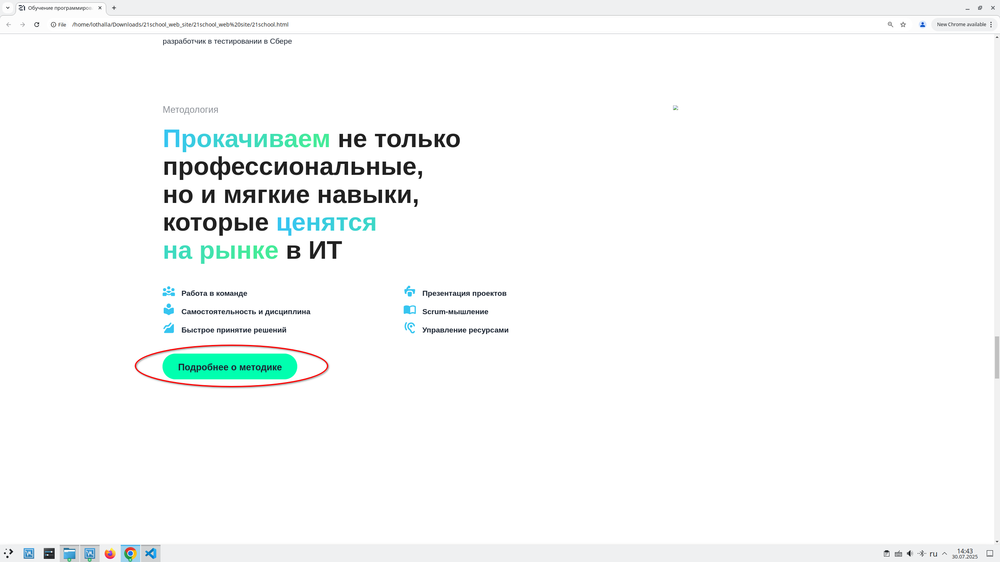

**Заголовок:** Лишние элементы(кнопки) в разделе "Ответы на вопросы"

**Подробное описание:** На странице школы (ссылка) в разделе "Ответы на вопросы" под заголовком "Часто задаваемые вопросы" 2 лишних элемента(кнопки), которых нет на макете - "Поступление", "Обучение"

**Ожидаемый результат:** При переходе на сайт школы в разделе "Ответы на вопросы" под заголовком "Часто задаваемые вопросы" есть только перечень популярных вопросов о школе

**Фактический результат:** При переходе на сайт школы в разделе "Ответы на вопросы" под заголовком "Часто задаваемые вопросы" 2 лишних элемента(кнопки), которых нет на макете - "Поступление", "Обучение"

**Шаги по воспроизведению:**

1. Открыть макет сайта https://www.figma.com/design/eTKqLIoG72PDLMuLUM4g7n/%D0%A1%D0%B1%D0%B5%D1%8021?node-id=0-1&p=f&t=WVif7Dth1VyTmZPS-0

2. Открыть сайт (ссылка) 

3. Опуститься в раздел "Часто задаваемые вопросы"

4. Убедиться, что на сайте в  данном блоке присутствуют лишние элеиенты(кнопки) - "Поступление", "Обучение"

**Окружение:** Linux 6.8.0-48-generic, Google Chrome 127.0.6533.99 

**Важность:** Minor

**Срочность:** Low

**Дополнительная информация:** скриншот, демонстрирующий проблему, приложен

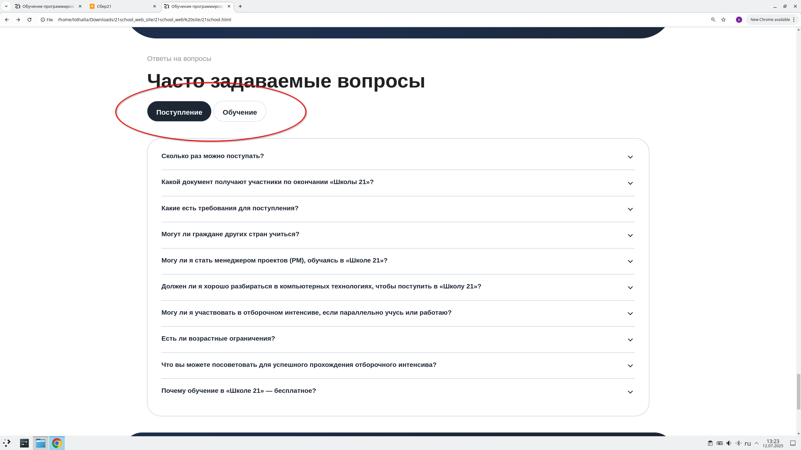

**Заголовок:** Лишние элементы(стрелочки) в разделе "Ответы на вопросы"

**Подробное описание:** На странице школы (ссылка) в разделе "Ответы на вопросы", справа от переченя популярных вопросов о школе есть стрелочки, которых нет на макете

**Ожидаемый результат:** При переходе на сайт школы в разделе "Ответы на вопросы" есть перечень популярных вопросов о школе без лишних элементов

**Фактический результат:** При переходе на сайт школы в разделе "Ответы на вопросы" , справа от переченя популярных вопросов о школе есть стрелочки, которых нет на макете

**Шаги по воспроизведению:**

1. Открыть макет сайта https://www.figma.com/design/eTKqLIoG72PDLMuLUM4g7n/%D0%A1%D0%B1%D0%B5%D1%8021?node-id=0-1&p=f&t=WVif7Dth1VyTmZPS-0

2. Открыть сайт (ссылка) 

3. Опуститься в раздел "Часто задаваемые вопросы"

4. Убедиться, что на сайте в данном блоке, справа от переченя популярных вопросов о школе есть лишние элементы(стрелочки), которых нет на макете 

**Окружение:** Linux 6.8.0-48-generic, Google Chrome 127.0.6533.99 

**Важность:** Minor

**Срочность:** Low

**Дополнительная информация:** скриншот, демонстрирующий проблему, приложен

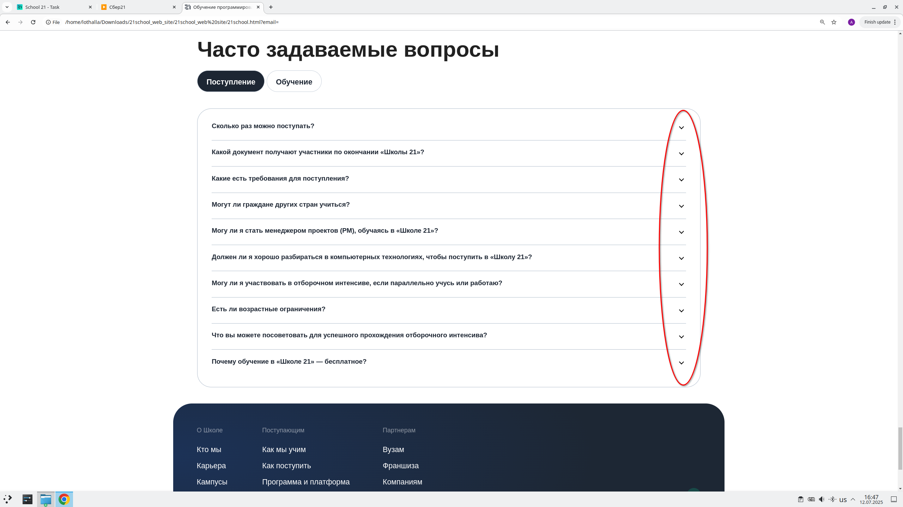

### Нет || не работает выпадающее меню

**Заголовок:** Не работает выпадающее меню у "Список городов" в хедере

**Подробное описание:** На странице школы (ссылка), в шапке сайта не работает выпадающее меню с вариантами городов у кнопки "Список городов"

**Ожидаемый результат:** При переходе на сайт школы в шапке сайта кнопка "Список городов" кликабельна, выскакивают варианты различных городов

**Фактический результат:** При переходе на сайт школы в шапке сайта кнопка "Список городов" некликабельна, не работает выпадающее меню с вариантами городов

**Шаги по воспроизведению:**

1. Открыть макет сайта https://www.figma.com/design/eTKqLIoG72PDLMuLUM4g7n/%D0%A1%D0%B1%D0%B5%D1%8021?node-id=0-1&p=f&t=WVif7Dth1VyTmZPS-0

2. Открыть сайт (ссылка) 

3. Нажать на "Список городов"

4. Убедиться, что кнопка не кликабельна, нет выпадающего меню с вариантами городов

**Окружение:** Linux 6.8.0-48-generic, Google Chrome 127.0.6533.99 

**Важность:** Major

**Срочность:** Medium

**Дополнительная информация:** скриншот, демонстрирующий проблему, приложен

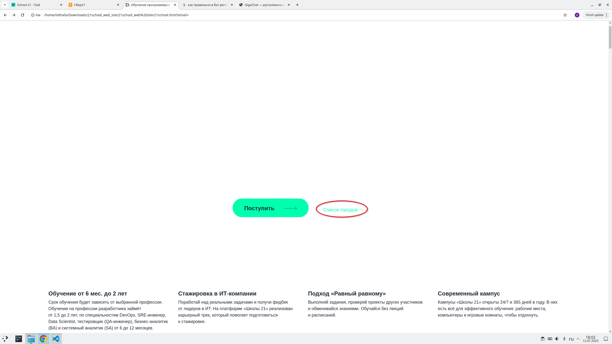

**Заголовок:** Нет выпадающего меню с вариантами городов и вариантами программ обучения в разделе "Заявка на поступление"

**Подробное описание:** На странице школы (ссылка), в разделе "Заявка на поступление" нет выпадающего меню с вариантами городов(нельзя выбрать город, по умолчанию стоит "Москва") и нет вариантов программ обучения(нельзя выбрать программу обучения, по умолчанию стоит "Разработчик ПО")

**Ожидаемый результат:** При переходе на сайт школы в разделе "Заявка на поступление" присутствует выпадающее меню с вариантами городов и вариантами выбора программы обучения

**Фактический результат:** При переходе на сайт школы в разделе "Заявка на поступление" нет выпадающего меню с вариантами городов и вариантов программ обучения

**Шаги по воспроизведению:**

1. Открыть макет сайта https://www.figma.com/design/eTKqLIoG72PDLMuLUM4g7n/%D0%A1%D0%B1%D0%B5%D1%8021?node-id=0-1&p=f&t=WVif7Dth1VyTmZPS-0

2. Открыть сайт (ссылка) 

3. Опуститься в раздел "Заявка на поступление"

4. Убедиться, что нет выпадающего меню (нельзя выбрать город / нельзя выбрать программу обучения)

**Окружение:** Linux 6.8.0-48-generic, Google Chrome 127.0.6533.99 

**Важность:** Critical

**Срочность:** High

**Дополнительная информация:** скриншот, демонстрирующий проблему, приложен

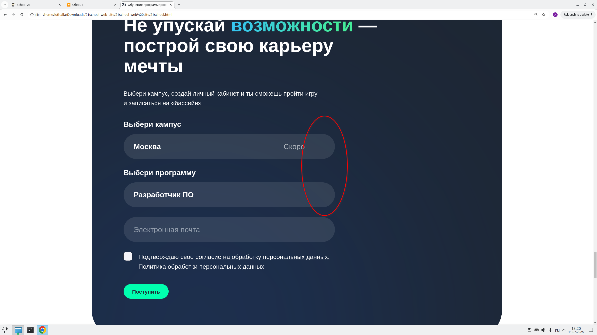

### Некорректная ссылка (перемещает не туда)

**Заголовок:** Кнопка "Поступить" в разделе "Заявка на поступление" перекидывает не туда

**Подробное описание:** На странице школы (ссылка), в разделе "Заявка на поступление" после клика на кнопку "Поступить", ссылка перекидывает в шапку сайта, а должна вести на страницу регистрации

**Ожидаемый результат:** При переходе на сайт школы в разделе "Заявка на поступление" после клика на кнопку "Поступить" ссылка ведет на страницу регистрации

**Фактический результат:** При переходе на сайт школы в разделе "Заявка на поступление" после клика на кнопку "Поступить", ссылка перекидывает в шапку сайта

**Шаги по воспроизведению:**

1. Открыть макет сайта https://www.figma.com/design/eTKqLIoG72PDLMuLUM4g7n/%D0%A1%D0%B1%D0%B5%D1%8021?node-id=0-1&p=f&t=WVif7Dth1VyTmZPS-0

2. Открыть сайт (ссылка) 

3. Опуститься в раздел "Заявка на поступление"

4. Кликнуть по кнопке "Поступить"

5. Убедиться, что ссылка ведет в шапку страницы, а не на страницу регистрации

**Окружение:** Linux 6.8.0-48-generic, Google Chrome 127.0.6533.99 

**Важность:** Critical

**Срочность:** High

**Дополнительная информация:** скриншот, демонстрирующий проблему, приложен

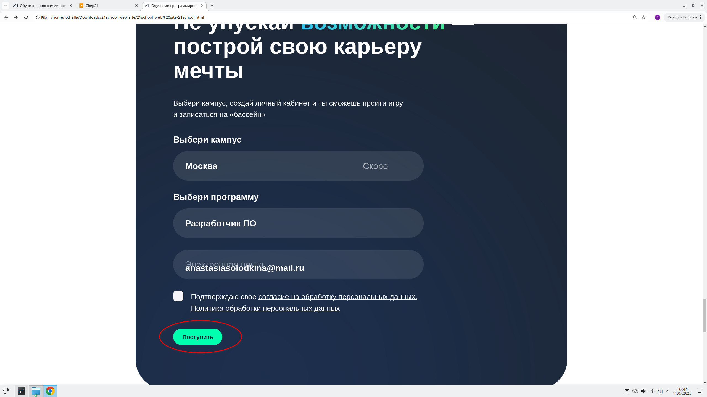 

### Некликабельные нопки 

**Заголовок:** Кнопка "Поступить" в хедере сайта не кликабельна

**Подробное описание:** На странице школы (ссылка), в шапке сайта, кнопка "Поступить" не кликабельна 

**Ожидаемый результат:** При переходе на сайт школы, в шапке сайта, кнопка "Поступить" кликабельная и переносит к разделу "Заявка на поступление"

**Фактический результат:** При переходе на сайт школы, в шапке сайта, кнопка "Поступить" не кликабельная (ничего не происходит при нажатии)

**Шаги по воспроизведению:**

1. Открыть макет сайта https://www.figma.com/design/eTKqLIoG72PDLMuLUM4g7n/%D0%A1%D0%B1%D0%B5%D1%8021?node-id=0-1&p=f&t=WVif7Dth1VyTmZPS-0

2. Открыть сайт (ссылка) 

3. Кликнуть по кнопке "Поступить"

4. Убедиться, что после нажатия ничего не происходит

**Окружение:** Linux 6.8.0-48-generic, Google Chrome 127.0.6533.99 

**Важность:** Major

**Срочность:** Medium

**Дополнительная информация:** скриншот, демонстрирующий проблему, приложен

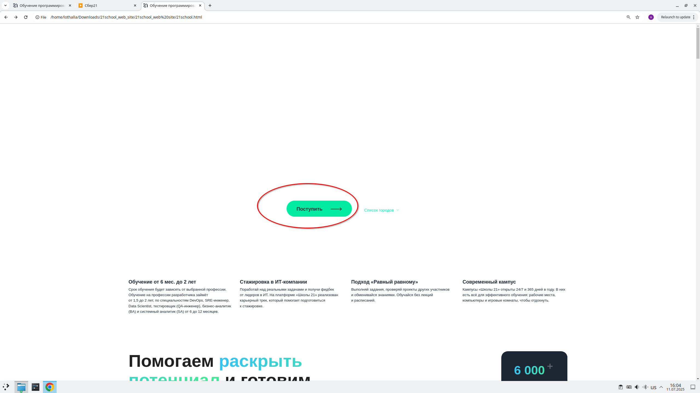 

**Заголовок:** Кнопки в разделе "Программа обучения" не кликабельны

**Подробное описание:** На странице школы (ссылка), в разделе "Программа обучения", кнопки: "Разработчик ПО", "DevOps- и SRE-инженеры", "QA-инженер", "Data Scientist", "Специалист по кибербезопасности", "Бизнес и системный аналитик" - не кликабельны

**Ожидаемый результат:** При переходе на сайт школы, в разделе "Программа обучения", кнопки: "Разработчик ПО", "DevOps- и SRE-инженеры", "QA-инженер", "Data Scientist", "Специалист по кибербезопасности", "Бизнес и системный аналитик" кликабельны. После нажатия на каждую программу обучения, высвечиваются определенные навыки, которые преобретает учащийся в шк 21

**Фактический результат:** При переходе на сайт школы, в разделе "Программа обучения", кнопки: "Разработчик ПО", "DevOps- и SRE-инженеры", "QA-инженер", "Data Scientist", "Специалист по кибербезопасности", "Бизнес и системный аналитик" не кликабельны, ничего не высвечивается

**Шаги по воспроизведению:**

1. Открыть макет сайта https://www.figma.com/design/eTKqLIoG72PDLMuLUM4g7n/%D0%A1%D0%B1%D0%B5%D1%8021?node-id=0-1&p=f&t=WVif7Dth1VyTmZPS-0

2. Открыть сайт (ссылка) 

3. Опуститься в раздел "Программа обучения"

4. Прокликать кнопки "Разработчик ПО", "DevOps- и SRE-инженеры", "QA-инженер", "Data Scientist", "Специалист по кибербезопасности", "Бизнес и системный аналитик"

5. Убедиться, что после нажатия ничего не происходит(не высвечиваются приобретаемые навыки во время учебы)

**Окружение:** Linux 6.8.0-48-generic, Google Chrome 127.0.6533.99 

**Важность:** Major

**Срочность:** Medium

**Дополнительная информация:** скриншот, демонстрирующий проблему, приложен

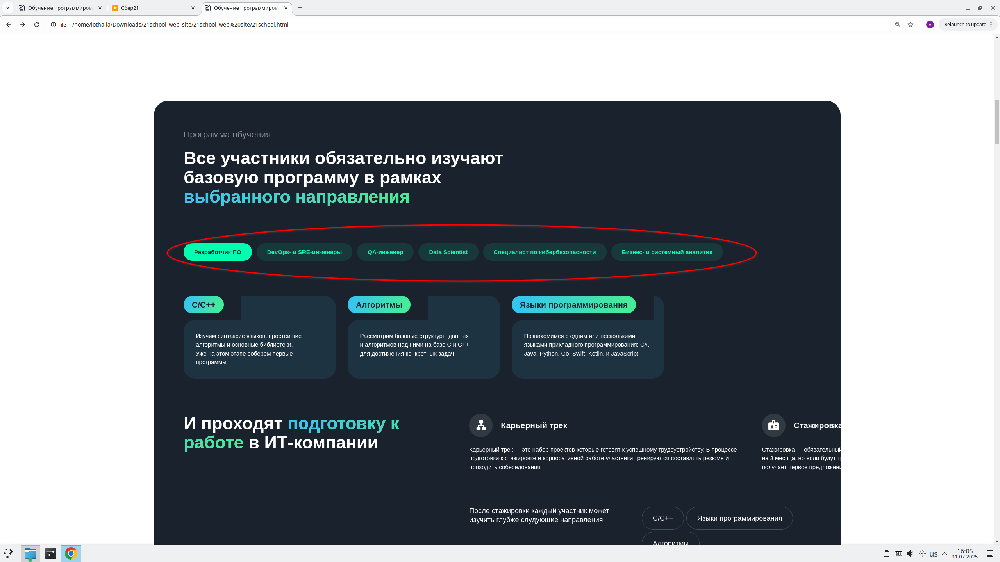 

**Заголовок:** Кнопка "Поступить" в разделе "Этапы поступления" не кликабельна

**Подробное описание:** На странице школы (ссылка), в разделе "Этапы поступления", кнопка "Поступить" не кликабельна, после нажатия ничего не происходит

**Ожидаемый результат:** При переходе на сайт школы, в разделе "Этапы поступления" кнопка "Поступить" кликабельная и переносит к разделу "Заявка на поступление"

**Фактический результат:** При переходе на сайт школы, в разделе "Этапы поступления", кнопка "Поступить" не кликабельна

**Шаги по воспроизведению:**

1. Открыть макет сайта https://www.figma.com/design/eTKqLIoG72PDLMuLUM4g7n/%D0%A1%D0%B1%D0%B5%D1%8021?node-id=0-1&p=f&t=WVif7Dth1VyTmZPS-0

2. Открыть сайт (ссылка) 

3. Опуститься в раздел "Этапы поступления"

4. Кликнуть по кнопке "Поступить"

5. Убедиться, что после нажатия ничего не происходит

**Окружение:** Linux 6.8.0-48-generic, Google Chrome 127.0.6533.99 

**Важность:** Major

**Срочность:** Medium

**Дополнительная информация:** скриншот, демонстрирующий проблему, приложен

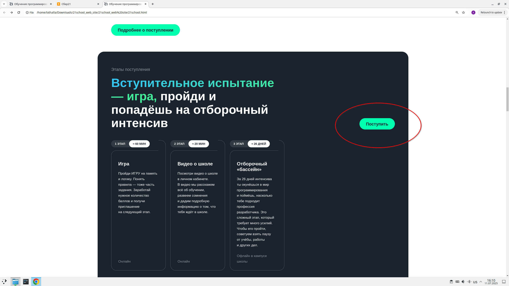 

**Заголовок:** Кнопка "Поступить" в разделе "Начало обучения" не кликабельна

**Подробное описание:** На странице школы (ссылка), в разделе "Начало обучения", кнопка "Поступить" не кликабельна, после нажатия ничего не происходит

**Ожидаемый результат:** При переходе на сайт школы, в разделе "Начало обучения" кнопка "Поступить" кликабельная и переносит к разделу "Заявка на поступление"

**Фактический результат:** При переходе на сайт школы, в разделе "Начало обучения", кнопка "Поступить" не кликабельна

**Шаги по воспроизведению:**

1. Открыть макет сайта https://www.figma.com/design/eTKqLIoG72PDLMuLUM4g7n/%D0%A1%D0%B1%D0%B5%D1%8021?node-id=0-1&p=f&t=WVif7Dth1VyTmZPS-0

2. Открыть сайт (ссылка) 

3. Опуститься в раздел "Начало обучения"

4. Кликнуть по кнопке "Поступить"

5. Убедиться, что после нажатия ничего не происходит

**Окружение:** Linux 6.8.0-48-generic, Google Chrome 127.0.6533.99 

**Важность:** Major

**Срочность:** Medium

**Дополнительная информация:** скриншот, демонстрирующий проблему, приложен

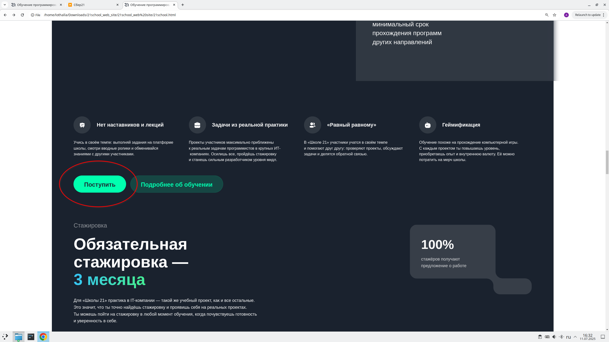 

**Заголовок:** Стрелочки < и > не кликабельны в разделе "Участники и выпускники о «Школе 21»"

**Подробное описание:** На странице школы (ссылка), в разделе "Участники и выпускники о «Школе 21»", под заголовком "Участники советуют обучение своим друзьям и родственникам", стрелочки < и > не кликабельны, из-за чего нельзя пролистать и посмотреть все видео в данном блоке

**Ожидаемый результат:** При переходе на сайт школы, в разделе "Участники и выпускники о «Школе 21»" стрелочки < и > кликабельны, можно полистать и ознакомиться со всеми видео материалами в данном блоке

**Фактический результат:** При переходе на сайт школы, в разделе "Участники и выпускники о «Школе 21»" стрелочки < и > не кликабельны, после нажатия ничего не происходит

**Шаги по воспроизведению:**

1. Открыть макет сайта https://www.figma.com/design/eTKqLIoG72PDLMuLUM4g7n/%D0%A1%D0%B1%D0%B5%D1%8021?node-id=0-1&p=f&t=WVif7Dth1VyTmZPS-0

2. Открыть сайт (ссылка) 

3. Опуститься в раздел "Участники и выпускники о «Школе 21»"

4. Кликнуть по кнопкам < и > 

5. Убедиться, что после нажатия ничего не происходит

**Окружение:** Linux 6.8.0-48-generic, Google Chrome 127.0.6533.99 

**Важность:** Major

**Срочность:** Medium

**Дополнительная информация:** скриншот, демонстрирующий проблему, приложен

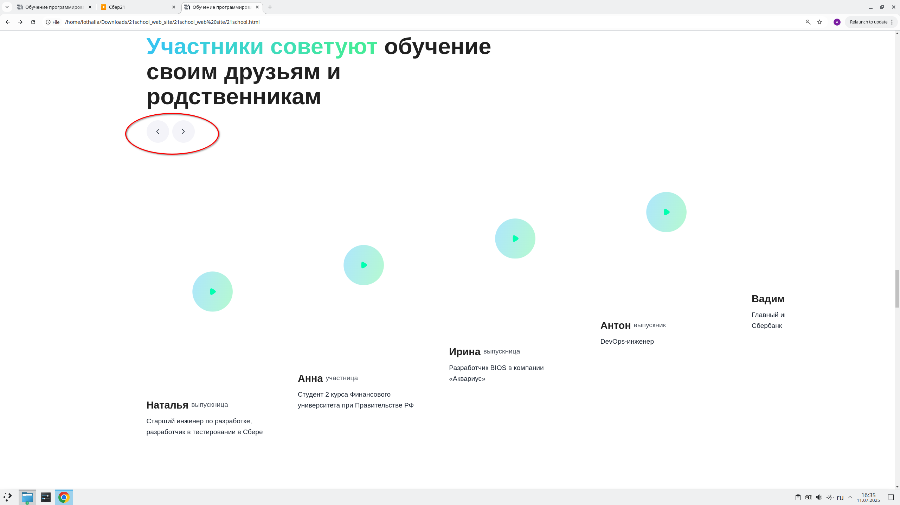 

**Заголовок:** Не ставится галочка у "Подтверждаю свое согласие на обработку персональных данных. Политика обработки персональных данных" в разделе "Заявка на поступление" 

**Подробное описание:** На странице школы (ссылка), в разделе "Заявка на поступление", в белом, квадратном маленьком поле, после нажатия на него ничего не происходит, хотя должна ставиться галочка - символ того, что абитуриент ознакомился с информацией, из-за этого не получится нажать на кнопку "Поступить", она будет не кликабельна

**Ожидаемый результат:** При переходе на сайт школы, в разделе "Заявка на поступление", после нажатия на белый маленький квадратик, должна появиться галочка, это свидетельствует о том, что человек ознакомился с информацией

**Фактический результат:** При переходе на сайт школы, в разделе "Заявка на поступление", после нажатия на белый маленький квадратик - галочка не ставится, из-за чего не получится нажать на кнопку "Поступить", она будет не кликабельна

**Шаги по воспроизведению:**

1. Открыть макет сайта https://www.figma.com/design/eTKqLIoG72PDLMuLUM4g7n/%D0%A1%D0%B1%D0%B5%D1%8021?node-id=0-1&p=f&t=WVif7Dth1VyTmZPS-0

2. Открыть сайт (ссылка) 

3. Опуститься в раздел "Заявка на поступление"

4. Кликнуть по белому, квадратному маленькому полю

5. Убедиться, что после нажатия ничего не происходит, галочка не ставится

**Окружение:** Linux 6.8.0-48-generic, Google Chrome 127.0.6533.99 

**Важность:** Blocker

**Срочность:** High

**Дополнительная информация:** скриншот, демонстрирующий проблему, приложен

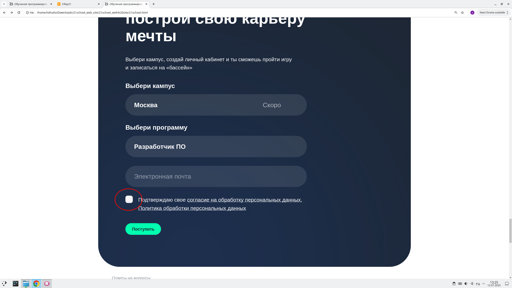 

### Видео не грузит

**Заголовок:** Видео материалы в разделе "Участники и выпускники о «Школе 21»" не прогружаются

**Подробное описание:** На странице школы (ссылка), в разделе "Участники и выпускники о «Школе 21»" при нажатии на любое из представленных видео (их 5), ничего не происходит, видео не грузится

**Ожидаемый результат:** При переходе на сайт школы, в разделе "Участники и выпускники о «Школе 21»" при нажатии на любой видео ролик он загружается

**Фактический результат:** При переходе на сайт школы, в разделе "Участники и выпускники о «Школе 21»" после нажатия на ведео ролик ничего не происходит, видео не грузится

**Шаги по воспроизведению:**

1. Открыть макет сайта https://www.figma.com/design/eTKqLIoG72PDLMuLUM4g7n/%D0%A1%D0%B1%D0%B5%D1%8021?node-id=0-1&p=f&t=WVif7Dth1VyTmZPS-0

2. Открыть сайт (ссылка) 

3. Опуститься в раздел "Участники и выпускники о «Школе 21»"

4. Прокликать все видео материалы представленные в данном блоке (их 5)

5. Убедиться, что после нажатия на все видео файлы ничего не происходит, они не загружаются

**Окружение:** Linux 6.8.0-48-generic, Google Chrome 127.0.6533.99 

**Важность:** Major

**Срочность:** Medium

**Дополнительная информация:** скриншот, демонстрирующий проблему, приложен

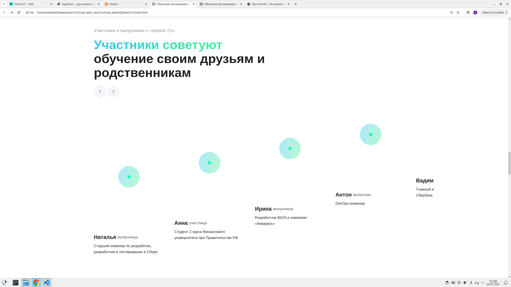 

### Электронная почта

**Заголовок:** В разделе "Заявка на поступление" при вводе электронной почты не убирается плейсхолдер

**Подробное описание:** На странице школы (ссылка), в разделе "Заявка на поступление" при вводе электронной почты не убирается плейсхолдер 

**Ожидаемый результат:** При переходе на сайт школы, в разделе "Заявка на поступление" при вводе электронной почты в поле больше ничего нет кроме него, плейсхолдер автоматически убирается 

**Фактический результат:** При переходе на сайт школы, в разделе "Заявка на поступление" при вводе электронной почты в поле также присутствует плейсхолдер, он не исчезает

**Шаги по воспроизведению:**

1. Открыть макет сайта https://www.figma.com/design/eTKqLIoG72PDLMuLUM4g7n/%D0%A1%D0%B1%D0%B5%D1%8021?node-id=0-1&p=f&t=WVif7Dth1VyTmZPS-0

2. Открыть сайт (ссылка) 

3. Опуститься в раздел "Заявка на поступление"

4. Ввести электронную почту

5. Убедиться, что после ввода эл. почты плейсхолдер не исчезает

**Окружение:** Linux 6.8.0-48-generic, Google Chrome 127.0.6533.99 

**Важность:** Minor

**Срочность:** Low

**Дополнительная информация:** скриншот, демонстрирующий проблему, приложен

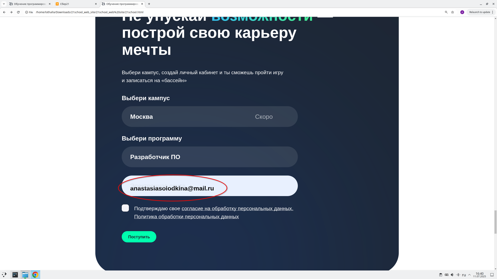 

### Зумирование сайта

**Заголовок:** При зумировании сайта съезжают граф. элементы, такст

**Подробное описание:** При зумировании страницы (ссылка) начинает ехать такст и граф. элементы

**Ожидаемый результат:** При зумировании страницы (ссылка) страница отображается корректно

**Фактический результат:** При зумировании страницы (ссылка) съезжают граф. элементы и текст, что визуально портит вид сайта

**Шаги по воспроизведению:**

1. Открыть сайт (ссылка) 

2. Прозумировать страницу до предельного значения (25%)

3. Убедиться, что съехал текст и граф. элементы

**Окружение:** Linux 6.8.0-48-generic, Google Chrome 127.0.6533.99 

**Важность:** Minor

**Срочность:** Low

**Дополнительная информация:** скриншот, демонстрирующий проблему, приложен

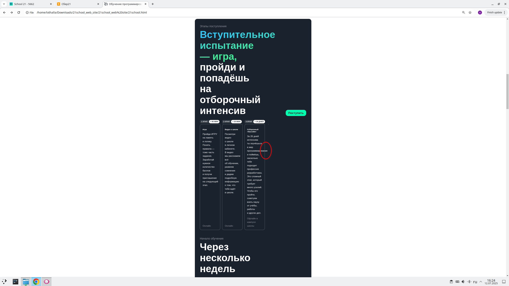 

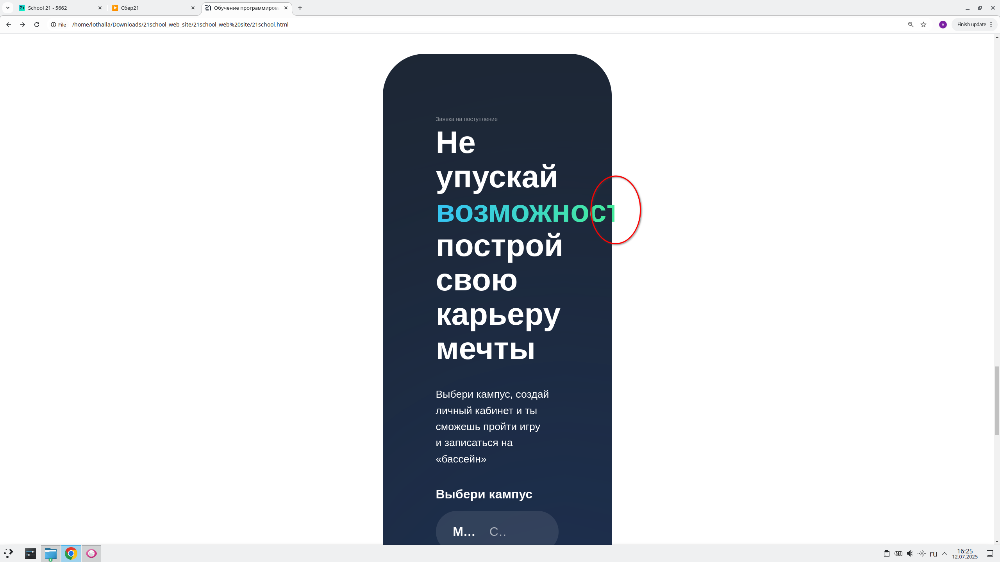 

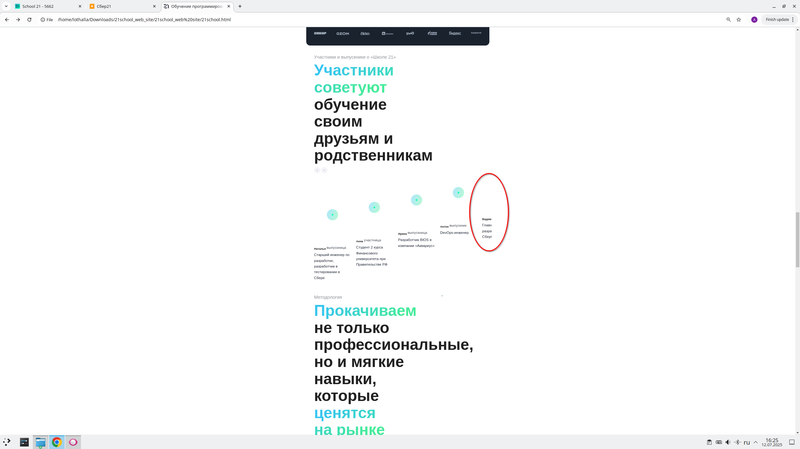 

## Цвет текста

**Заголовок:** Цвет текста в разделе "Программа обучения" отличается от цвета на макете

**Подробное описание:** На странице школы (ссылка), в разделе "Программа обучения", цвет текста "И проходят подготовку к работе в ИТ‑компании" отличается от цвета, представленного на макете

**Ожидаемый результат:** При переходе на сайт школы в разделе "Программа обучения", цвет текста "И проходят подготовку к работе в ИТ‑компании" соответствует цветовой гамме на макете

**Фактический результат:** При переходе на сайт школы в разделе "Программа обучения", цвет текста "И проходят подготовку к работе в ИТ‑компании" отличается от цвета, представленного на макете

**Шаги по воспроизведению:**   

1. Открыть макет сайта https://www.figma.com/design/eTKqLIoG72PDLMuLUM4g7n/%D0%A1%D0%B1%D0%B5%D1%8021?node-id=0-1&p=f&t=WVif7Dth1VyTmZPS-0

2. Открыть сайт (ссылка) 

3. Опуститься в раздел "Программа обучения"

4. Сравнить данный раздел на макете с сайтом

5. Убедиться, что цвет текста "И проходят подготовку к работе в ИТ‑компании" отличается от цвета, представленного на макете

**Окружение:** Linux 6.8.0-48-generic, Google Chrome 127.0.6533.99 

**Важность:** Trivial

**Срочность:** Low

**Дополнительная информация:** скриншот, демонстрирующий проблему, приложен

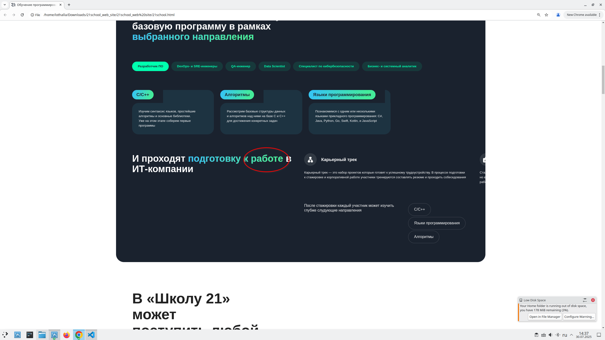

**Заголовок:** Цвет текста в разделе "Начало обучения" отличается от цвета на макете

**Подробное описание:** На странице школы (ссылка), в разделе "Начало обучения", цвет текста "Через несколько недель после «бассейна» начнётся учёба" отличается от цвета, представленного на макете

**Ожидаемый результат:** При переходе на сайт школы в разделе "Начало обучения", цвет текста "Через несколько недель после «бассейна» начнётся учёба" соответствует цветовой гамме на макете

**Фактический результат:** При переходе на сайт школы в разделе "Начало обучения", цвет текста "Через несколько недель после «бассейна» начнётся учёба" отличается от цвета, представленного на макете

**Шаги по воспроизведению:**   

1. Открыть макет сайта https://www.figma.com/design/eTKqLIoG72PDLMuLUM4g7n/%D0%A1%D0%B1%D0%B5%D1%8021?node-id=0-1&p=f&t=WVif7Dth1VyTmZPS-0

2. Открыть сайт (ссылка) 

3. Опуститься в раздел "Начало обучения"

4. Сравнить данный раздел на макете с сайтом

5. Убедиться, что цвет текста "Через несколько недель после «бассейна» начнётся учёба" отличается от цвета, представленного на макете

**Окружение:** Linux 6.8.0-48-generic, Google Chrome 127.0.6533.99 

**Важность:** Trivial

**Срочность:** Low

**Дополнительная информация:** скриншот, демонстрирующий проблему, приложен

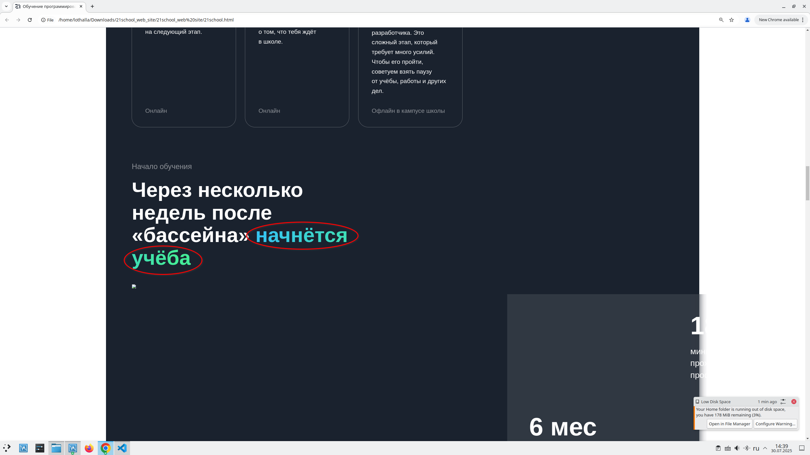

**Заголовок:** Цвет текста в разделе "Стажировка" отличается от цвета на макете

**Подробное описание:** На странице школы (ссылка), в разделе "Стажировка", цвет текста "Обязательная стажировка — 3 месяца" отличается от цвета, представленного на макете

**Ожидаемый результат:** При переходе на сайт школы в разделе "Стажировка", цвет текста "Обязательная стажировка — 3 месяца" соответствует цветовой гамме на макете

**Фактический результат:** При переходе на сайт школы в разделе "Стажировка", цвет текста "Обязательная стажировка — 3 месяца" отличается от цвета, представленного на макете

**Шаги по воспроизведению:**   

1. Открыть макет сайта https://www.figma.com/design/eTKqLIoG72PDLMuLUM4g7n/%D0%A1%D0%B1%D0%B5%D1%8021?node-id=0-1&p=f&t=WVif7Dth1VyTmZPS-0

2. Открыть сайт (ссылка) 

3. Опуститься в раздел "Стажировка"

4. Сравнить данный раздел на макете с сайтом

5. Убедиться, что цвет текста "Обязательная стажировка — 3 месяца" отличается от цвета, представленного на макете

**Окружение:** Linux 6.8.0-48-generic, Google Chrome 127.0.6533.99 

**Важность:** Trivial

**Срочность:** Low

**Дополнительная информация:** скриншот, демонстрирующий проблему, приложен

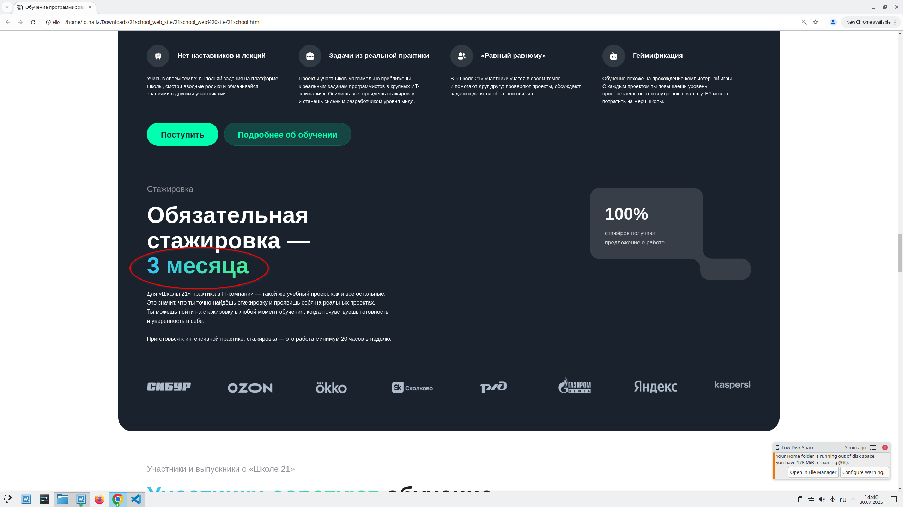

**Заголовок:** Цвет текста в разделе "Участники и выпускники о «Школе 21»" отличается от цвета на макете

**Подробное описание:** На странице школы (ссылка), в разделе "Участники и выпускники о «Школе 21»", цвет текста "Участники советуют обучение своим друзьям и родственникам" отличается от цвета, представленного на макете

**Ожидаемый результат:** При переходе на сайт школы в разделе "Участники и выпускники о «Школе 21»", цвет текста "Участники советуют обучение своим друзьям и родственникам" соответствует цветовой гамме на макете

**Фактический результат:** При переходе на сайт школы в разделе "Участники и выпускники о «Школе 21»", цвет текста "Участники советуют обучение своим друзьям и родственникам" отличается от цвета, представленного на макете

**Шаги по воспроизведению:**   

1. Открыть макет сайта https://www.figma.com/design/eTKqLIoG72PDLMuLUM4g7n/%D0%A1%D0%B1%D0%B5%D1%8021?node-id=0-1&p=f&t=WVif7Dth1VyTmZPS-0

2. Открыть сайт (ссылка) 

3. Опуститься в раздел "Участники и выпускники о «Школе 21»"

4. Сравнить данный раздел на макете с сайтом

5. Убедиться, что цвет текста "Участники советуют обучение своим друзьям и родственникам" отличается от цвета, представленного на макете

**Окружение:** Linux 6.8.0-48-generic, Google Chrome 127.0.6533.99 

**Важность:** Trivial

**Срочность:** Low

**Дополнительная информация:** скриншот, демонстрирующий проблему, приложен

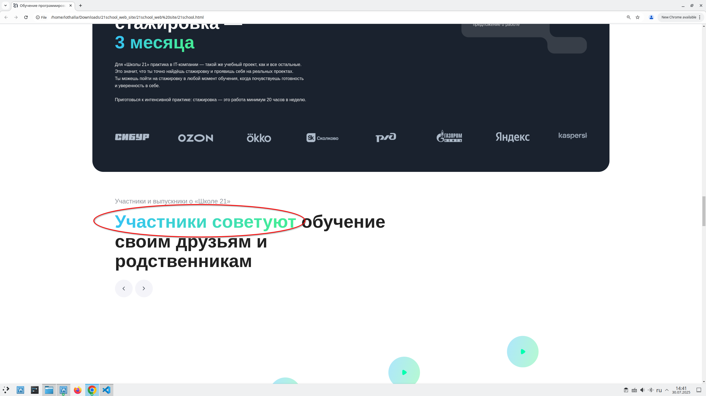

**Заголовок:** Цвет текста в разделе "Методология" отличается от цвета на макете

**Подробное описание:** На странице школы (ссылка), в разделе "Методология", цвет текста "Прокачиваем не только профессиональные, но и мягкие навыки, которые ценятся на рынке в ИТ" отличается от цвета, представленного на макете

**Ожидаемый результат:** При переходе на сайт школы в разделе "Методология", цвет текста "Прокачиваем не только профессиональные, но и мягкие навыки, которые ценятся на рынке в ИТ" соответствует цветовой гамме на макете

**Фактический результат:** При переходе на сайт школы в разделе "Методология", цвет текста "Прокачиваем не только профессиональные, но и мягкие навыки, которые ценятся на рынке в ИТ" отличается от цвета, представленного на макете

**Шаги по воспроизведению:**   

1. Открыть макет сайта https://www.figma.com/design/eTKqLIoG72PDLMuLUM4g7n/%D0%A1%D0%B1%D0%B5%D1%8021?node-id=0-1&p=f&t=WVif7Dth1VyTmZPS-0

2. Открыть сайт (ссылка) 

3. Опуститься в раздел "Методология"

4. Сравнить данный раздел на макете с сайтом

5. Убедиться, что цвет текста "Прокачиваем не только профессиональные, но и мягкие навыки, которые ценятся на рынке в ИТ" отличается от цвета, представленного на макете

**Окружение:** Linux 6.8.0-48-generic, Google Chrome 127.0.6533.99 

**Важность:** Trivial

**Срочность:** Low

**Дополнительная информация:** скриншот, демонстрирующий проблему, приложен

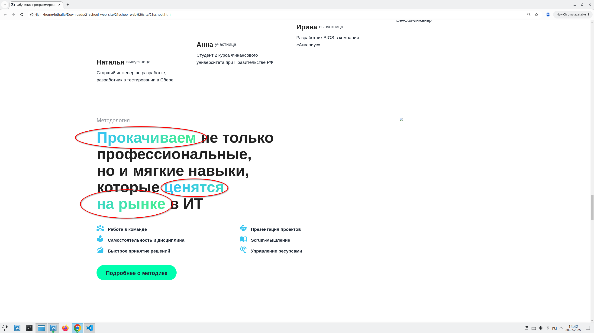
